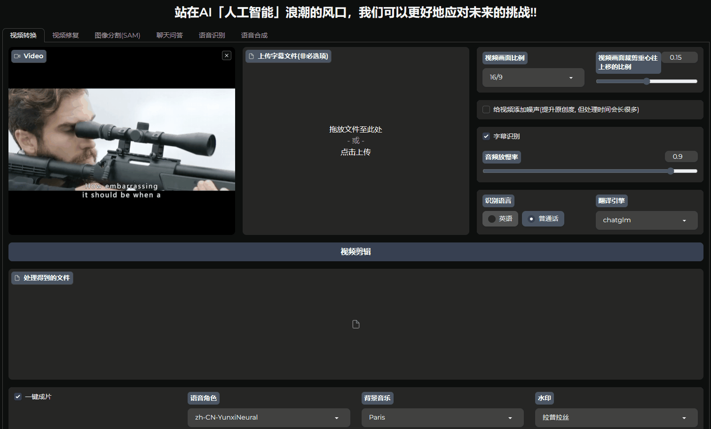
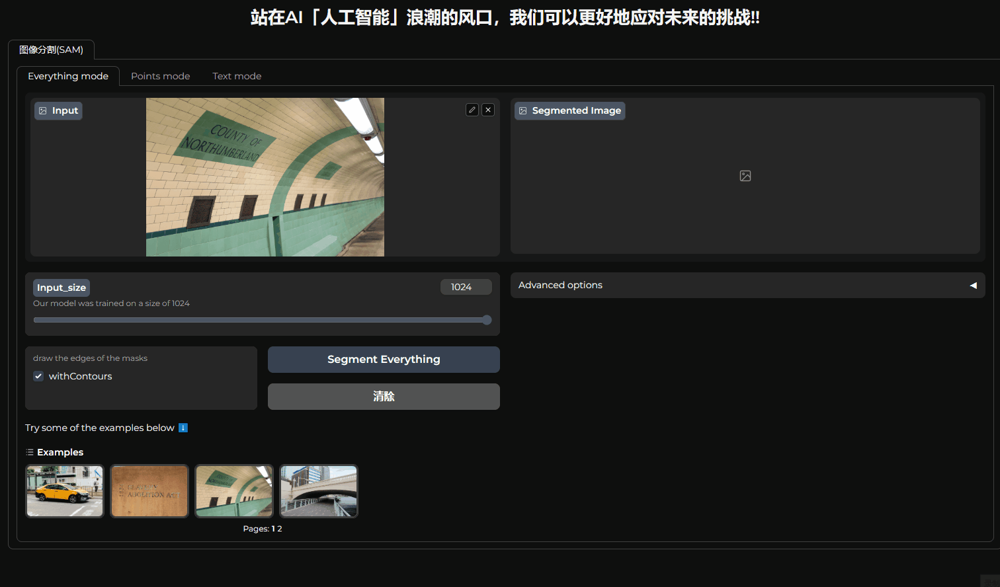
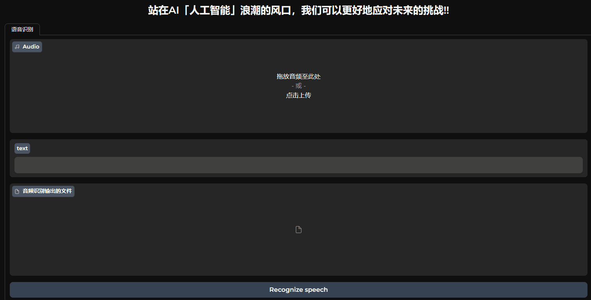
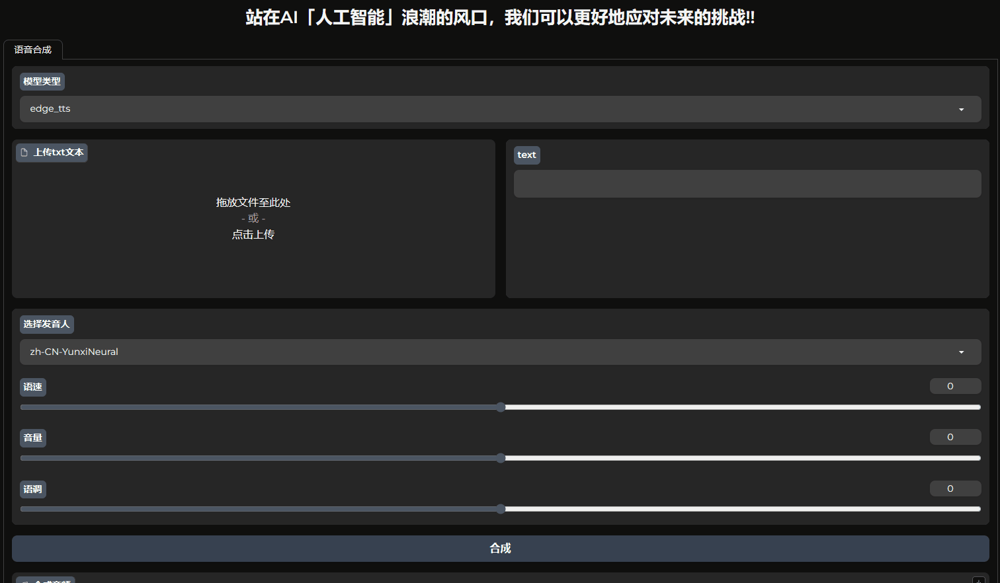
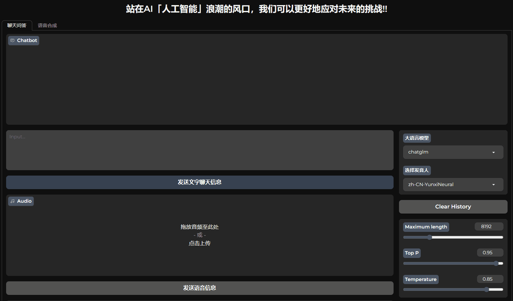

<div align="center">

<div class="logo">
   <a href="">
      
   </a>
</div>

<h1>AI-WEBUI: A universal web interface for AI creation, 一款好用的A工具</h1>


⭐ 如果对你有帮助，麻烦给个star，感谢! 🤗
</div>

## 🌟 1. 简介
ai-webui是一个基于浏览器操作的界面，旨在提供一个通用的AI创作平台。


本项目提供了图像分割、目标追踪、图像修复、语音识别、语音合成等基本功能，以及集成得到的聊天问答、视频翻译、视频去水印等有利于大幅提高短视频创作效率的高级功能。

## ⚡2. 安装

要安装并使用AI-WebUI，请按照以下步骤操作：

### 2.1 克隆此项目到本地计算机

```bash
git clone https://github.com/jasonaidm/ai_webui.git
```

### 2.2 进入项目目录

```bash
cd ai_webui
```
### 2.3 创建虚拟环境
```bash
conda create -n aiwebui python=3.11
conda activate aiwebui
```

### 2.4 安装所需的依赖项

```bash
apt install ffmpeg -y 
pip install -r requirements.txt
```


## 🚀3. 快速开始

使用AI-WebUI非常简单。只需要按照界面上的指示进行操作即可。你可以通过上传视频、音频、图片或输入文本等方式输入创作要素，并与模型的输出进行交互。
```bash
python webui.py -c ./configs/webui_configs.yml
```

启动后，在浏览器中打开 `http://localhost:9090/?__theme=dark` 查看项目界面。

### 3.1 单一功能示例
考虑到部分用户个人电脑的GPU性能问题，我们提供单功能示例，用户可以单独运行一个AI功能，而不需要启动整个项目。

1. 图像分割
- 全景分割
- 基于points坐标信息的提示词分割
- 基于文本提示词的分割
```bash
python webui.py -c ./configs/segmentation_demo.yml
```


2. 语音识别
- 中英文等多语言识别
```bash
python webui.py -c ./configs/asr_demo.yml
```


3. 语音合成
- 中英文等多语言合成
```bash
python webui.py -c ./configs/tts_demo.yml
```



### 3.2 组合功能示例
通过多个AI模型组合得到更为复杂的功能，对显卡资源要求较高。
1. 聊天问答
- 文本流式对话功能
- 语音对话功能
```bash
python webui.py -c ./configs/chatbot_demo.yml
```


2. 视频修复
- 去水印
- 去马赛克
- 目标追踪
- 消除视频里的特定物体

```bash
python webui.py -c ./configs/video_inpainter_demo.yml
```


3. 视频转换
- 音视频分离
- 画面裁剪
- 画面加噪
- 抽帧取帧
- 音频识别
- 字幕翻译
- 语音合成
- bgm添加
- 视频一键生成(外网视频无脑搬运)
```bash
python webui.py -c ./configs/video_convertor_demo.yml
```


### 3.3 全功能上线
通过下列命令，打开所有AI功能：
```bash
python webui.py -c ./configs/webui_configs.yml
```
由于模型加载耗时较长，建议在启动后的第一次推理时加载模型。
可通过configs/base.yml配置文件的"init_model_when_start_server"来控制每一个AI模型的加载策略。

## 🔥4. 模型文件
### 4.1 模型文件下载
| 模型 | 模型文件大小 | 小模型清单 | 下载链接 | 
| :--- | :--- | :--- | :--- |
| chatglm2-6b-int4 | 3.7G | ✅ | [百度网盘](https://pan.baidu.com/s/1d-eRdvX-wRgm4XUJ24G30A)|
| chatglm2-6b | 12G |  | [清华大学云盘](https://cloud.tsinghua.edu.cn/d/674208019e314311ab5c/?p=%2Fchatglm2-6b&mode=list) |
| sam_vit_b | 358M | ✅ | [百度网盘](https://pan.baidu.com/s/1d-eRdvX-wRgm4XUJ24G30A) | 
| sam_vit_h | 2.4G |  | [百度网盘](https://pan.baidu.com/s/1d-eRdvX-wRgm4XUJ24G30A) | 
| FastSAM-s | 23M | ✅ | [百度网盘](https://pan.baidu.com/s/1d-eRdvX-wRgm4XUJ24G30A) | 
| FastSAM-x | 138M |  | [百度网盘](https://pan.baidu.com/s/1d-eRdvX-wRgm4XUJ24G30A) | 
| ProPainter | 150M | ✅ | [百度网盘](https://pan.baidu.com/s/1d-eRdvX-wRgm4XUJ24G30A) | 
| raft-things | 20M | ✅ | [百度网盘](https://pan.baidu.com/s/1d-eRdvX-wRgm4XUJ24G30A) | 
| recurrent_flow_completion | 19M | ✅ | [百度网盘](https://pan.baidu.com/s/1d-eRdvX-wRgm4XUJ24G30A ) | 
| cutie | 134M | ✅ | [百度网盘](https://pan.baidu.com/s/1d-eRdvX-wRgm4XUJ24G30A) | 
| whisper-samll | 461M | ✅ | [百度网盘](https://pan.baidu.com/s/1d-eRdvX-wRgm4XUJ24G30A) | 
| whisper-large-v3 | 2.9G |  | [百度网盘](https://pan.baidu.com/s/1d-eRdvX-wRgm4XUJ24G30A) | 

- 百度网盘提取码为：zogk

### 4.2 模型权重文件的目录结构
```
model_weights/
├── chatglm
│   └── chatglm2-6b-int4
│       ├── config.json
│       ├── configuration_chatglm.py
│       ├── modeling_chatglm.py
│       ├── pytorch_model.bin
│       ├── quantization.py
│       ├── tokenization_chatglm.py
│       ├── tokenizer.model
│       └── tokenizer_config.json
├── fastsam
│   ├── FastSAM-s.pt
│   └── FastSAM-x.pt
├── propainter
│   ├── ProPainter.pth
│   ├── cutie-base-mega.pth
│   ├── raft-things.pth
│   └── recurrent_flow_completion.pth
├── sam
│   ├── sam_vit_b.pth
│   └── sam_vit_h.pth
└── whisper
    ├── large-v3.pt
    └── small.pt
```
如果GPU显存小于8G，可能要小模型才能跑得起来；但小模型的效果不太理想，有条件的尽量跑大模型。

## 5. 贡献

如果你有任何建议或功能请求，欢迎提出一个 issue。

## 6. 参考
 - [Segment-ant-Track-Anything](https://github.com/z-x-yang/Segment-and-Track-Anything)
 - [ProPainter](https://github.com/sczhou/ProPainter)
 - [ChatGLM2-6B](https://github.com/THUDM/ChatGLM2-6B)
 - [segment-anything](https://github.com/facebookresearch/segment-anything)
 - [FastSAM](https://github.com/CASIA-IVA-Lab/FastSAM)
 - [whisper](https://github.com/openai/whisper)