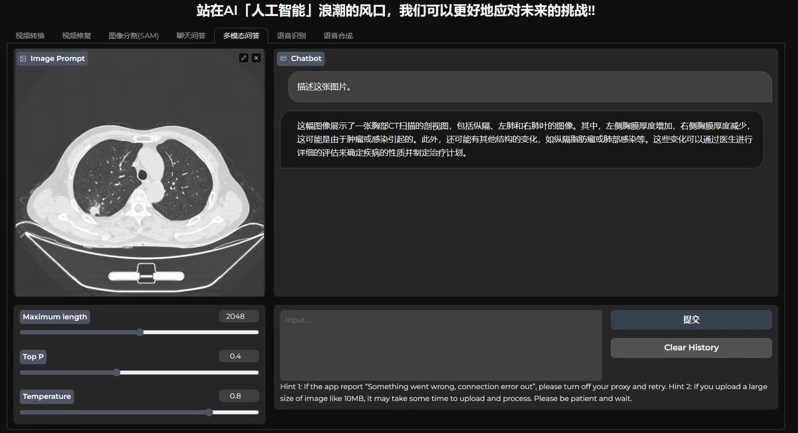

<div align="center">

<div class="logo">
   <a href="">
      
   </a>
</div>

<h1>AI-WEBUI: A universal web interface for AI creation, a handy tool for image, audio, and video processing</h1>


⭐ If it helps you, please give it a star, thank you! 🤗
[中文文档](./README_cn.md)
</div>

## 🌟 1. Introduction
ai-webui is a browser-based interface designed to provide a universal AI creation platform.


This project provides basic functionalities such as image segmentation, object tracking, image restoration, speech recognition, speech synthesis, as well as advanced features such as chatbot, video translation, and video watermark removal, which greatly improve the efficiency of short video creation.

## ⚡2. Installation

To install and use AI-WebUI, follow these steps:

### 2.1 Clone this project to your local machine

```bash
git clone https://github.com/jasonaidm/ai_webui.git
```

### 2.2 Enter the project directory

```bash
cd ai_webui
```
### 2.3 Create a virtual environment
```bash
conda create -n aiwebui python=3.11
conda activate aiwebui
```

### 2.4 Install the required dependencies

```bash
apt install ffmpeg -y 
pip install -r requirements.txt
```


## 🚀3. Quick Start

Using AI-WebUI is very simple. Just follow the instructions on the interface. You can input creative elements by uploading videos, audios, images, or entering text, and interact with the model's output.
```bash
python webui.py -c ./configs/webui_configs.yml
```

After starting, open `http://localhost:9090/?__theme=dark` in your browser to see the project interface.

### 3.1 Single Function Demo
Considering the GPU performance issues of some users' personal computers, we provide single function demos that allow users to run a specific AI function without starting the entire project.

1. Image Segmentation
- Panorama segmentation
- Segmentation based on points coordinates
- Segmentation based on textual prompts
```bash
python webui.py -c ./configs/segmentation_demo.yml
```


2. Speech Recognition
- Multilingual speech recognition (e.g., Chinese and English)
```bash
python webui.py -c ./configs/asr_demo.yml
```


3. Speech Synthesis
- Multilingual speech synthesis (e.g., Chinese and English)
```bash
python webui.py -c ./configs/tts_demo.yml
```


### 3.2 Combined Function Demo
More complex functions can be obtained by combining multiple AI models, requiring higher GPU resources.
1. Chatbot
- Text-based chatbot
- Voice-based chatbot
```bash
python webui.py -c ./configs/chatbot_demo.yml
```


2. Video Restoration
- Watermark removal
- Mosaic removal
- Object tracking
- Object removal in videos
```bash
python webui.py -c ./configs/video_inpainter_demo.yml
```


3. Video Conversion
- Audio-video separation
- Image cropping
- Image noise addition
- Frame extraction
- Speech recognition
- Subtitle translation
- Speech synthesis
- BGM addition
- One-click video generation (automatic video replication from the internet)
```bash
python webui.py -c ./configs/video_convertor_demo.yml
```


### 3.3 Full-function Online
Open all AI functions by running the following command:
```bash
python webui.py -c ./configs/webui_configs.yml
```
Since model loading takes a long time, it is recommended to load the models during the first inference after starting.
You can control the loading strategy of each AI model through the "init_model_when_start_server" option in the `configs/base.yml` configuration file.

## 🔥4. Model Files
### 4.1 Model File Downloads
| Model | Model File Size | Small Model List | Download Link | 
| :--- | :--- | :--- | :--- |
| chatglm2-6b-int4 | 3.7G | ✅ | [Baidu Netdisk](https://pan.baidu.com/s/1d-eRdvX-wRgm4XUJ24G30A)|
| chatglm2-6b | 12G |  | [Tsinghua University Cloud Disk](https://cloud.tsinghua.edu.cn/d/674208019e314311ab5c/?p=%2Fchatglm2-6b&mode=list)|
| sam_vit_b | 358M | ✅ | [Baidu Netdisk](https://pan.baidu.com/s/1d-eRdvX-wRgm4XUJ24G30A) | 
| sam_vit_h | 2.4G |  | [Baidu Netdisk](https://pan.baidu.com/s/1d-eRdvX-wRgm4XUJ24G30A) | 
| FastSAM-s | 23M | ✅ | [Baidu Netdisk](https://pan.baidu.com/s/1d-eRdvX-wRgm4XUJ24G30A) | 
| FastSAM-x | 138M |  | [Baidu Netdisk](https://pan.baidu.com/s/1d-eRdvX-wRgm4XUJ24G30A) | 
| ProPainter | 150M | ✅ | [Baidu Netdisk](https://pan.baidu.com/s/1d-eRdvX-wRgm4XUJ24G30A) | 
| raft-things | 20M | ✅ | [Baidu Netdisk](https://pan.baidu.com/s/1d-eRdvX-wRgm4XUJ24G30A) | 
| recurrent_flow_completion | 19M | ✅ | [Baidu Netdisk](https://pan.baidu.com/s/1d-eRdvX-wRgm4XUJ24G30A) | 
| cutie | 134M | ✅ | [Baidu Netdisk](https://pan.baidu.com/s/1d-eRdvX-wRgm4XUJ24G30A) | 
| whisper-samll | 461M | ✅ | [Baidu Netdisk](https://pan.baidu.com/s/1d-eRdvX-wRgm4XUJ24G30A) | 
| whisper-large-v3 | 2.9G |  | [Baidu Netdisk](https://pan.baidu.com/s/1d-eRdvX-wRgm4XUJ24G30A) |

- The extraction code for Baidu Netdisk is: zogk

### 4.2 Directory Structure of Model Weight Files
```
model_weights/
├── chatglm
│   └── chatglm2-6b-int4
│       ├── config.json
│       ├── configuration_chatglm.py
│       ├── modeling_chatglm.py
│       ├── pytorch_model.bin
│       ├── quantization.py
│       ├── tokenization_chatglm.py
│       ├── tokenizer.model
│       └── tokenizer_config.json
├── fastsam
│   ├── FastSAM-s.pt
│   └── FastSAM-x.pt
├── propainter
│   ├── ProPainter.pth
│   ├── cutie-base-mega.pth
│   ├── raft-things.pth
│   └── recurrent_flow_completion.pth
├── sam
│   ├── sam_vit_b.pth
│   └── sam_vit_h.pth
└── whisper
    ├── large-v3.pt
    └── small.pt
```
If the GPU memory is less than 8G, you may need to use the small models to run the project; however, the performance of the small models may not be ideal, so it is recommended to run the large models if possible.

## 5. Contributing

If you have any suggestions or feature requests, please feel free to create an issue.

## 6. References
 - Segment-ant-Track-Anything
 - ProPainter
 - ChatGLM2-6B
 - segment-anything
 - FastSAM
 - whisper